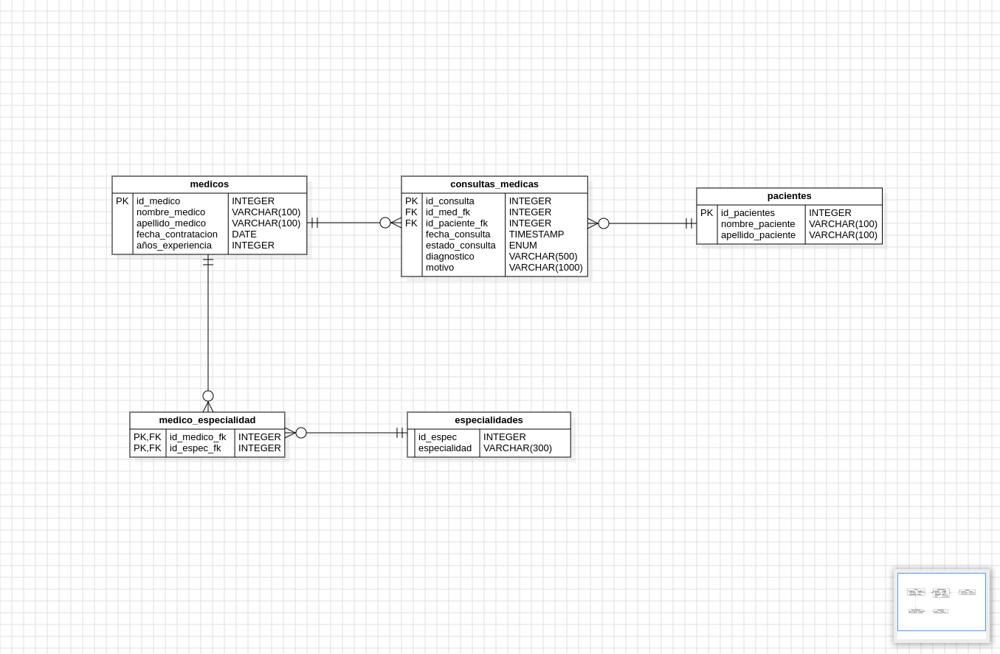

# 🏥 MediSistema – Gestión Hospitalaria

## 📌 Descripción del Proyecto

Este proyecto consiste en el diseño de una base de datos relacional para el centro de salud **MediSistema**. El objetivo principal es gestionar de manera eficiente la información de médicos, especialidades, pacientes y consultas médicas, garantizando la integridad de los datos y aplicando principios de normalización.

---

## 🎯 Objetivos

- Diseñar un modelo relacional correcto y normalizado.
- Representar entidades, atributos, claves primarias (PK) y foráneas (FK).
- Implementar la estructura de la base de datos en MySQL.
- Resolver consultas SQL de diferentes niveles (básico a intermedio).

---

## 🧱 Modelo de Datos

El sistema está compuesto por las siguientes entidades principales:

- **medicos**
- **especialidades**
- **medico_especialidad** (tabla intermedia)
- **pacientes**
- **consultas_medicas**

### 🔗 Relaciones

- Un médico puede tener múltiples especialidades (**relación muchos a muchos**).
- Un paciente puede tener múltiples consultas (**1:N**).
- Un médico puede atender múltiples consultas (**1:N**).
- La tabla `consultas_medicas` actúa como puente entre médicos y pacientes.

---

## 🛠️ Tecnologías Utilizadas

- **StarUML** → Diseño del diagrama lógico  
- **MySQL** → Gestión de base de datos  
- **GitHub** → Control de versiones  
- **SQL** → Definición y manipulación de datos  

---

## 📁 Estructura del Proyecto

```bash
medisistema_taller/
├── README.md
└── almacenamiento/
   └── mysql/
       ├── db.sql
       ├── insert.sql
       └── consultas.sql
└── diagramas/
    └── diagrama_logico.png
```

---

## 📄 Descripción de Archivos

### 🧩 `db.sql`
Contiene la definición de la base de datos (DDL):
- Creación de tablas
- Definición de claves primarias y foráneas
- Relaciones entre entidades

---

### 📊 `insert.sql`
Contiene datos de prueba (DML):
- Inserción de médicos, pacientes, especialidades y consultas
- Generado con apoyo de Inteligencia Artificial (solo permitido en este taller)

---

### 🔍 `consultas.sql`
Incluye la solución a las 20 consultas propuestas:
- Consultas básicas
- Filtros y búsquedas
- Agregaciones
- Análisis de datos

Cada consulta incluye:
- Número
- Enunciado
- Código SQL

---

### 🧠 `diagrama_logico.png`
- Representación visual del modelo relacional
- Diseñado en **StarUML**
- Incluye entidades, atributos y relaciones



---

## 📌 Consideraciones Importantes

- El modelo está diseñado siguiendo principios de **normalización**.
- Se evita la redundancia de datos mediante el uso de claves foráneas.
- Se implementa una tabla intermedia para relaciones muchos a muchos.
- Se garantiza la integridad referencial en todas las relaciones.

---

## 🚀 Cómo Ejecutar el Proyecto

1. Crear una base de datos en MySQL.
2. Ejecutar el archivo `db.sql`.
3. Ejecutar el archivo `insert.sql` para poblar los datos.
4. Ejecutar `consultas.sql` para validar las consultas.

---

## 📚 Autor

Proyecto desarrollado por [Jorge Gomez](https://github.com/jorgegmch) como parte del proceso de formación en bases de datos y desarrollo backend.

---

## ✅ Estado del Proyecto

✔ Diseño lógico completado  
✔ Base de datos implementada  
✔ Consultas resueltas  
✔ Documentación incluida  