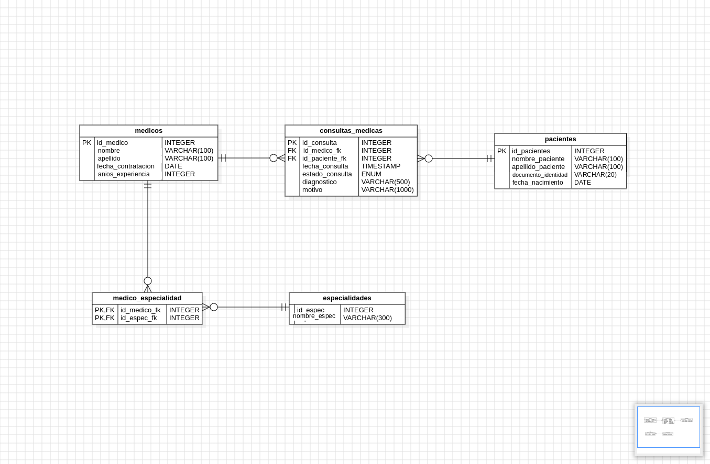

# MediSistema — Hospital Management Database

A normalized relational database design for a hospital management system, modeling doctors, specialties, patients, and medical consultations with full referential integrity.

## Overview

This project defines the relational schema, seed data, and query layer for **MediSistema**, a fictional hospital's data management system. It focuses on:

- A relational model designed to avoid redundant data.
- Primary and foreign key constraints enforcing referential integrity.
- A dedicated junction table resolving the many-to-many relationship between doctors and specialties.
- A set of 20 SQL queries covering filtering, joins, aggregation, and subqueries.

## Data Model

| Table | Role |
|---|---|
| `medicos` | Doctors |
| `pacientes` | Patients |
| `consultas_medicas` | Medical consultations (links a doctor and a patient) |
| `especialidades` | Catalog of medical specialties |
| `medico_especialidad` | Junction table resolving the many-to-many relationship between doctors and specialties |

### Relationships

- A doctor can have multiple specialties, and a specialty can be held by multiple doctors (**many-to-many**, via `medico_especialidad`).
- A patient can have multiple consultations (**1:N**).
- A doctor can attend multiple consultations (**1:N**).

## ER Diagram



Designed in **StarUML**.

## Tech Stack

- MySQL 8.0+
- SQL (DDL / DML)
- StarUML (ER diagram)
- Git / GitHub

## Project Structure

```
medisistema-hospital-db/
├── README.md
├── LICENSE
├── .gitignore
├── diagrams/
│   └── medisistema_logical_diagram.png
└── scripts/
    ├── medisistema_schema.sql
    ├── medisistema_seed.sql
    └── medisistema_queries.sql
```

## Files

- **`scripts/medisistema_schema.sql`** — DDL: database creation with explicit `utf8mb4` / `utf8mb4_spanish_ci` charset, table definitions, primary and foreign keys.
- **`scripts/medisistema_seed.sql`** — DML: sample (fictional) data for doctors, patients, specialties, and consultations.
- **`scripts/medisistema_queries.sql`** — 20 solved queries, from basic filtering to aggregation and subqueries.

## Getting Started

Run the scripts against a MySQL 8.0+ server, in order:

```bash
mysql -u <user> -p < scripts/medisistema_schema.sql
mysql -u <user> -p < scripts/medisistema_seed.sql
mysql -u <user> -p < scripts/medisistema_queries.sql
```

> Adjust this if you're running the scripts through a GUI client (DBeaver, MySQL Workbench) instead of the CLI.

## License

This project is licensed under the MIT License.

---

Built by [Jorge Gomez](https://github.com/jorgegmch)